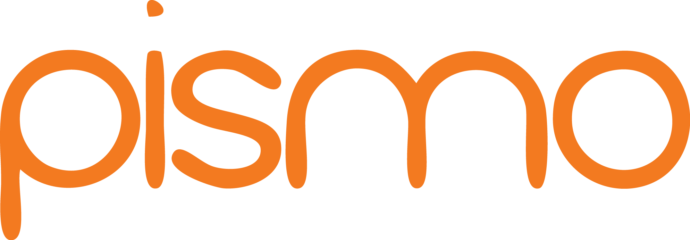

import { Head, Notes, Image, Appear } from 'mdx-deck'
import { CodeSurfer } from 'mdx-deck-code-surfer'
import { script } from "mdx-deck/themes"
export { default as theme } from './theme'

import styled from 'styled-components'

export const LayoutStyled = styled.div`
  width: '100vw';
  height: '100vw';
  padding: '10vw';
`

export const istiopsColor = { color: '#6878FF' };
export const hightlight = { color: '#6878FF' };

import ComparisonChart from "components/Chartist"

<Head>
  <title> istiops </title>
  <link href="https://fonts.googleapis.com/css?family=Nunito&display=swap" rel="stylesheet"></link>
</Head>

<!-- Slide 00 -->

<h1>Shifting com istiops</h1>
Estratégias de deploy do Istio com Golang

<Notes>
  
- Quick self-introduction

  
- O que vamos falar hoje?

  
- estratégias: rolling, canary, weight

  
- Canary + weight usando istio

  
- Paginar em relação ao Istio

</Notes>

---
<!-- Slide 01 -->

<LayoutStyled style={{fontSize: 24}}>

  <h2>O que é o Istio?</h2>

  <h4>Service Mesh</h4>

  - Segurança e políticas
  - Observabilidade
  - Escalabilidade e performance
  - Modelos de deployment
  -  Gerenciamento de tráfego 

<Notes>
  
- Segurança: mTLS, funciona bem com k8s network policy

  
- Observabilidade: prometheus, logging (exportable), grafana, tracing (zipkin)

  
- Modelos de deployment: istio multi-clusters

  
- Tráfego: A/B test, canary release, weight release

</Notes>

</LayoutStyled>

---

<!-- Slide 02 -->

<LayoutStyled style={{fontSize: 24}}>

  <h2>Gerenciamento de tráfego</h2>

  <h4> Funcionalidades </h4>

  - Auto-discovery de serviços e balanceamento
  - Roteamento de tráfego
  - Resiliência de rede e testes

</LayoutStyled>

---

<!-- Slide 02 -->

<LayoutStyled style={{fontSize: 24}}>

  <h2>Gerenciamento de tráfego</h2>

  <h4> Como opera? </h4>

  - VirtualServices
  - DestinationRules

<Notes>
  script
</Notes>

</LayoutStyled>

---

<!-- Slide 03 -->

<LayoutStyled style={{fontSize: 24}}>

  <h2>Barreiras</h2>

  - Difícil manutenção
  - Difícil de conseguir um estado atual dos tráfegos
  - Componentes sensíveis

</LayoutStyled>

---

<!-- Slide 04 -->

<LayoutStyled style={{fontSize: 24}}>

  <h2>O que é o  istiops ?</h2>

  - Simplifica o gerenciamento de tráfego do Istio
  - Agnóstico à plataforma como CLI
  - "Plugável"
  - Open source :raised_hands: 

</LayoutStyled>

---

<!-- Slide 04 -->

<LayoutStyled style={{fontSize: 24}}>

  <h2>Por que escolhemos Golang?</h2>

  - Fácil de manter
  - Fácil de testar
  - Velocidade de execução
  - Binário multi-plataforma como artefato
  - Orientado a Interfaces
  - Boa curva de aprendizagem
  - Debugging

</LayoutStyled>

<Notes>
  
 - Tipagem estática (structs) 

  
 - Curva de aprendizado baixa 

  
 - Debug: set -x ou echo '' 

</Notes>

---

<!-- Slide 06 -->

<h2>Estratégias de deploy</h2>

Como o  istiops  é capaz de me ajudar com isso?

<Notes>
  
 Segurança e facilidade para uma operação tão crítica que pode custar caro 

</Notes>

---

<!-- Slide 06 -->

<h2>Como eu uso o  istiops ?</h2>

A deep dive ao CLI & uso geral

---

<!-- Slide 07 -->

<Image
src="assets/imgs/howitworks1.png"
size="70vw"
/>

---

<!-- Slide 08 -->

<Image
src="assets/imgs/intro.png"
size="60vw"
/>

---

<!-- Slide 09 -->

<CodeSurfer
  title='show'
  lang='bash'
  showNumbers={false}
  dark={false}
  code={require('!raw-loader!./snippets/cli/show.sh')}
  steps={[
    { notes: 'Get all active traffic rules' },
    { lines: [2], notes: '-l key=value,key2=value2' },
    { lines: [3], notes: 'k8s namespace' },
    { lines: [4], notes: "'json' or 'yaml'" },
  ]}
/>

---

<!-- Slide 10 -->

<CodeSurfer
  title='clear'
  lang='bash'
  showNumbers={false}
  dark={false}
  code={require('!raw-loader!./snippets/cli/clear.sh')}
  steps={[
    { notes: 'Clear all rules (except master one)' },
  ]}
/>

---

<!-- Slide 12 -->

  <CodeSurfer
    title='headers'
    lang='bash'
    showNumbers={false}
    dark={false}
    code={require('!raw-loader!./snippets/cli/traffic_headers.sh')}
    steps={[
      { notes: 'Set new traffic based on headers' },
      { lines: [2], notes: "Build" },
      { lines: [3], notes: "Labels" },
      { lines: [4], notes: "Request Headers" },
      { lines: [5], notes: "Destination" },
      { lines: [6], notes: "Pod Selector" },
    ]}
  />

---

<!-- Slide 13 -->

<Image
  src="assets/imgs/howitworks2.png"
  size="55vw"
/>

---

<!-- Slide 13 -->

<CodeSurfer
  title='weight'
  lang='bash'
  showNumbers={false}
  dark={false}
  code={require('!raw-loader!./snippets/cli/traffic_weight.sh')}
  steps={[
    { notes: 'Set new traffic based on weight' },
    { lines: [4], notes: "Weight" },
  ]}
/>

---

<!-- Slide 14 -->

<Image
  src="assets/imgs/howitworks3.png"
  size="55vw"
/>

---

<LayoutStyled>
  <h2>Shared Libraries x  istiops </h2>
  <ComparisonChart>
  </ComparisonChart>
</LayoutStyled>

<Notes>
  
 Jenkins via Shell versus Golang 

</Notes>

---

<!-- Slide 15 -->

<h2>Importing as a pkg</h2>

./examples/main.go

---

<!-- Slide 16 -->

  <CodeSurfer
    title='pkg/operator/operator.go'
    lang='go'
    showNumbers={true}
    dark={false}
    code={require('!raw-loader!./snippets/importing-as-pkg/interface.go')}
    steps={[
      { notes: '' },
      { range: [2, 4], notes: 'implemented by struct `operator.istiops`' },
    ]}
  />

---

  <CodeSurfer
    title='pkg/operator/istiops.go'
    lang='go'
    showNumbers={true}
    dark={false}
    code={require('!raw-loader!./snippets/importing-as-pkg/istiops_struct.go')}
    steps={[
      { notes: '' },
      { range: [2, 3], notes: 'Resource routers interface' },
    ]}
  />

---

  <CodeSurfer
    title='pkg/operator/istiops.go'
    lang='go'
    showNumbers={true}
    dark={false}
    code={require('!raw-loader!./snippets/importing-as-pkg/router.go')}
    steps={[
      { notes: '' },
      { tokens: { 2: [ 1 ] }, notes: "Creates a new internal resource" },
      { tokens: { 3: [ 1 ] }, notes: "Validates internal resources" },
      { tokens: { 4: [ 1 ] }, notes: "Updates internal resources" },
      { tokens: { 5: [ 1 ] }, notes: "Clear all internal resources" },
      { tokens: { 6: [ 1 ] }, notes: "Lists internal resources" },
    ]}
  />

---

<Image
src="assets/imgs/overview.png"
size="70vw"
/>

---

<!-- Slide 16 -->

  <CodeSurfer
    title='main.go'
    lang='go'
    showNumbers={true}
    dark={false}
    code={require('!raw-loader!./snippets/importing-as-pkg/main.go')}
    steps={[
      { notes: '' },
      { lines: [19, 20], notes: 'retrieve clients' },
      { lines: [30, 31, 39, 40], notes: 'set the router structs' },
      // create resource's route struct
      { lines: [26, 33, 42], notes: 'Name' },
      { lines: [27, 34, 43], notes: 'Namespace' },
      { lines: [28, 35, 44], notes: 'Build' },
      { lines: [20, 36, 45], notes: 'Client' },
      // create resource's shift struct
      { range: [48, 64], notes: 'Traffic Shift' },
      { lines: [52], notes: 'Traffic' },
      { range: [53, 57], notes: 'Pod Selector' },
      { range: [58, 61], notes: 'Request Headers' },
      { lines:  [62], notes: 'Weight' },
      // operator interface it self
      { range: [66, 71], notes: 'Initialize interface' },
      { lines: [72], notes: 'Get current routes' },
      { lines: [73], notes: 'Clear routes' },
      { lines: [74], notes: 'Update a route' },
    ]}
  />

---

<!-- Slide 17 -->

<LayoutStyled>

<Image
  src="assets/imgs/demo.png"
  size="70vw"
/>

</LayoutStyled>

---

<!-- Slide 18 -->

<LayoutStyled style={{fontSize: 24}}>

<h2>That's all, folks!</h2>

<https://github.com/pismo/istiops> [project]

<https://vsantos.github.io/gophercon> [presentation]

<https://pismo.io/> [We are hiring :eyes:]

</LayoutStyled>
